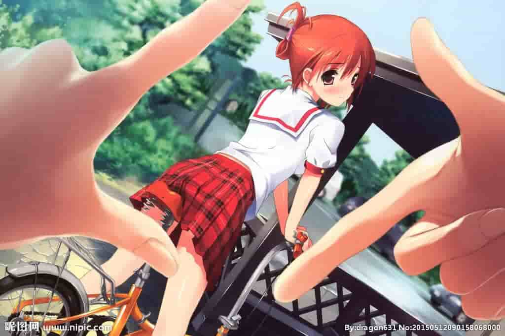
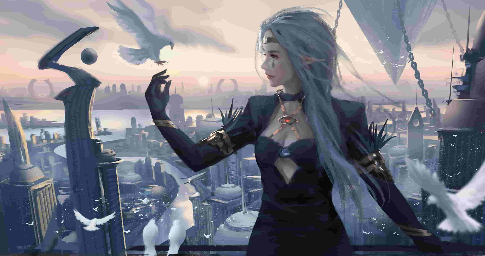
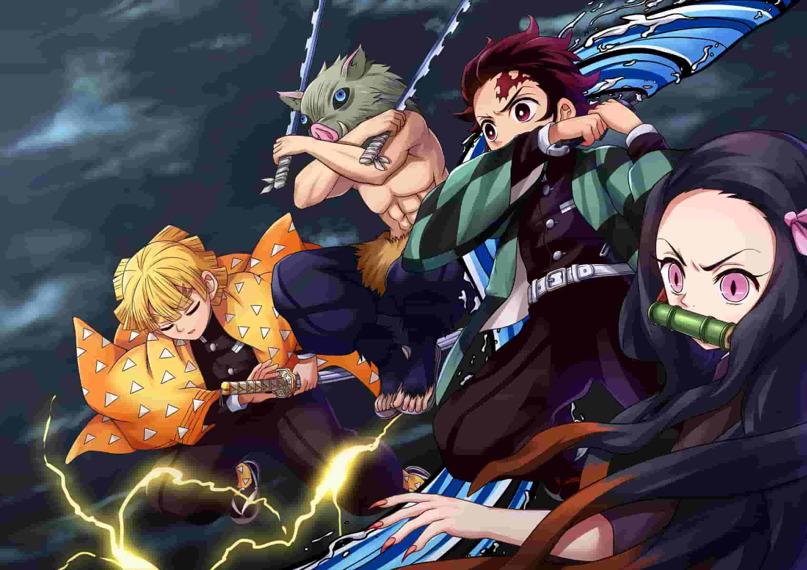

```html

<!DOCTYPE html>
<html>
<head>
	<meta charset="UTF-8">
	<title>完成轮播界面</title>
	<script src="js/tools.js" type="text/javascript" charset="utf-8"></script>
	<script type="text/javascript">
		window.onload = function(){
			var box1 = document.getElementById("box1");
			var imgList = document.getElementById("imgList");
			var li = document.getElementsByTagName("li");
			var navDiv = document.getElementById("navDiv");
			var allA = document.getElementsByTagName("a");
			var time1;
			/*默认显示图片的索引*/
			var index = 0;
			/*设置imgList的宽度*/
			imgList.style.width = (1064*(li.length))+"px";
			/*每向左移动1064px，就切换到下一张图片*/
			/*设置导航按钮居中*/
			navDiv.style.left = (box1.offsetWidth-navDiv.offsetWidth)/2+"px";
			/*设置默认选中的效果*/
			allA[index].style.backgroundColor = "deeppink";
			/*点击超链接，切换到指定的图片*/
			/*为所有的超链接绑定单击响应函数*/
			for(var i=0;i<allA.length;i++){
				/*为每个超链接添加一个num属性*/
				allA[i].num = i;
				allA[i].onclick = function(){
					/*点击获取超链接的索引*/
					//alert(this.num);
					/*将默认索引值修改为点击的超链接的索引*/
					index = this.num;
					/*imgList.style.left = -1064*index+"px";*/
					/*当我们点击的时候，需要将轮播动画关掉*/
					clearInterval(time1);
					move(imgList,-1064*index,120,"left",function(){
						/*点击动画执行完毕，继续开启轮播动画*/
						autoChange();
					});
					/*修改我们正在修改的a标签*/
					setA();
				};
			};
			/*开启自动切换图片*/
			autoChange();
			/*创建一个方法，用来设置选中的a超链接*/
			function setA(){
				/*判断当前索引是否是最后一张图片*/
				if(index>=li.length-1){
					/*则将index设置为0*/
					index =0;
					/*此时显示最后一张图片，但最后一张图片和第一张图片完全一样，
           * 此时通过css将最后一张切换为第一张*/
					imgList.style.left ="0px";
				}
				for(var i=0;i<allA.length;i++){
					/*将所有的a标签设置为palevioletred色，空字符串防止设置的内联样式对我们css设置的鼠标移入
          移入的伪类产生影响，空字符串将内联颜色样式设置为空，则css样式生效*/
					allA[i].style.backgroundColor = "";
				};
				/*将点击选中的a设置为deeppink色*/
				allA[index].style.backgroundColor = "deeppink";
			};
			/*创建构造一个函数，自动切换图片*/
			function autoChange(){
				/*开启一个定时器，用来定时去切换图片*/
				time1 = setInterval(function(){
					/*使得索引自增*/
					index++;
					index %= li.length;
					/*执行动画切换*/
					move(imgList,-1064*index,120,"left",function(){
						/*修改导航按钮*/
						setA();
					});
				},3000)
			}
		};
	</script>
	<style type="text/css">
		*{
			padding: 0;
			margin: auto;
		}
		img{
			width: 1024px;
			height: 683px;
		}
		#box1{
			padding: 0;
			margin: 0;
			width: 1064px;
			height: 683px;
			position: absolute;
			padding: 20px 0;
			left:50% ;
			top: 50%;
			margin-left:-517px ;
			margin-top: -341.5px;
			background-color: lightpink;
			overflow: hidden;
		}
		#imgList{
			height: 723px;
			padding: 0;
			margin: 0;
			/*去除标题符号*/
			list-style: none;
			position: absolute;
			left: 0;
		}
		li{
			display: block;
			padding:0;
			margin: 0 20px;
			float: left;
		}
		#navDiv{
			/*开启绝对定位*/
			position: absolute;
			/*设置位置*/
			bottom: 70px;
			/*设置left值
           div#box1的宽度1064px
           navDiv的宽度240px*/
			left:0;
		}
		#navDiv a{
			display: block;
			width: 20px;
			height: 20px;
			background-color: palevioletred;
			float: left;
			margin: 0 10px;
			/*设置透明*/
			opacity: 0.7;
		}
		/*设置导航链接鼠标移入的效果*/
		#navDiv a:hover{
			background-color: deeppink;
		}
	</style>
</head>
<body>
<div id="box1">
	<!--创建一个ul列表，用于放置图片-->
	<ul id="imgList">
		<li></li>
		<li></li>
		<li></li>
		<li></li>
		<li></li>
		<li></li>
		<li></li>
	</ul>
	<!--创建导航按钮-->、
	<div id="navDiv">
		<a href="javascript:;"></a>
		<a href="javascript:;"></a>
		<a href="javascript:;"></a>
		<a href="javascript:;"></a>
		<a href="javascript:;"></a>
		<a href="javascript:;"></a>
	</div>
</div>
</body>
</html>

```