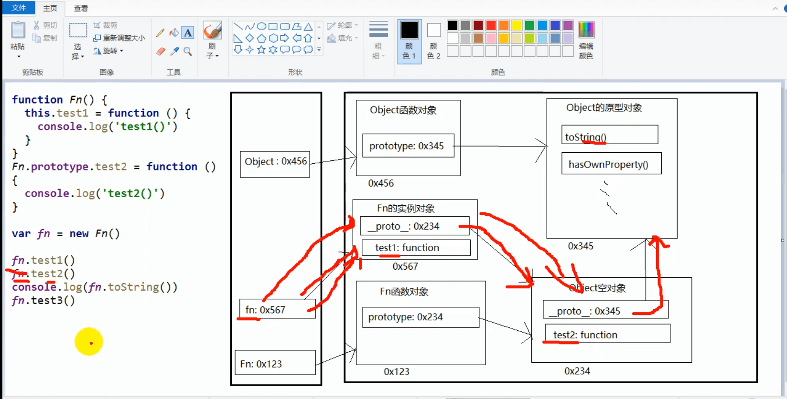

# 所有函数的__proto__都是一样的



```js
function Fn(){
			this.test1 = function(){
				console.log("sss")
			}
		}
		Fn.prototype.test2 = function(){
			console.log("xxx")
		}
		var fn = new Fn()
		fn.test1()
		fn.test2()
		console.log(fn.toString())
		/*fn.test3()//undefined*/
		
		
		/*function Foo(){}===>等价于var Foo = new Function(){}
		 */
		
		
		
		
		
		/*函数的显示原型指向的对象默认是空的object实例对象（但object不满足）*/
		console.log(Fn.prototype instanceof Object)//true
		console.log(Object.prototype instanceof Object)//false
		console.log(Function.prototype instanceof Object)//true
		/*所有函数都是Function的实例，包括他本身，Function的实例是他自己本身*/
		console.log(Function.__proto__===Function.prototype)//true
		/*object的原型对象是原型链的尽头，*/
		console.log(Object.prototype.__proto__)
```