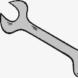

```html
<!DOCTYPE html>
<html>
	<head>
		<meta charset="UTF-8">
		<title>mac停靠栏</title>
		<style type="text/css">
			*{
				padding: 0;
				margin: 0;
			}
			html,body{
				height: 100%;
				overflow: hidden;
			}
			#wrap>img{
				width: 64px;
			}
			#wrap{
				position: absolute;
				bottom: 0;
				width: 100%;
				text-align: center;
			}
		</style>
	</head>
	<body>
		<div id="wrap">
			
			
			
			
				
			
		</div>
		
		
		
		
		
		
		
		
		
		<script type="text/javascript">
			window.onload = function(){
				var r = 400//初始化半径
				var allImg = document.querySelectorAll("img")
				document.onmousemove = function(ev){
					ev = ev||window.event
					for(var i=0;i<allImg.length;i++){
						var a =  allImg[i].getBoundingClientRect().left+allImg[i].offsetWidth/2-ev.clientX
						var b =  allImg[i].getBoundingClientRect().top+allImg[i].offsetHeight/2-ev.clientY
						var c = Math.sqrt(a*a+b*b)
						console.log("c:"+c)
						if(c>=r){
							c = r
						}else{
							allImg[i].style.width =192-(c*128/r) +"px"
						}
						
					}
					
					
					
				}
				
				
				
				
				
			}
			
		</script>
	</body>
</html>

```