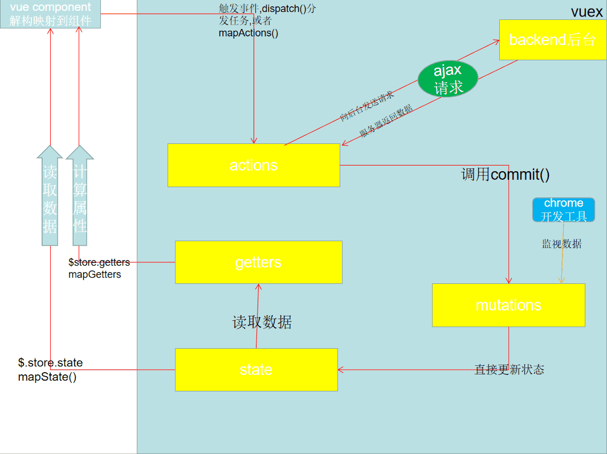

```html
<!DOCTYPE html>
<html lang="en">
<head>
    <meta charset="UTF-8">
    <title>vuex</title>
</head>
<body>

<!--总结：
        1.state:vuex管理的状态对象，且唯一                           （前线数据战况，战况有变，通知总部，$.store.dispatch("事件名",data)）
        2.actions:包含多个事件回调函数，可执行回调函数                （回调事件总部，通过commit()通知下属回调函数，）
        3.mutations:包含多个能接收到通知的回调函数                    （从总部得到对应的指令执行回调），
        4.getters：包含多个计算属性

    -->
</body>
</html>
```

