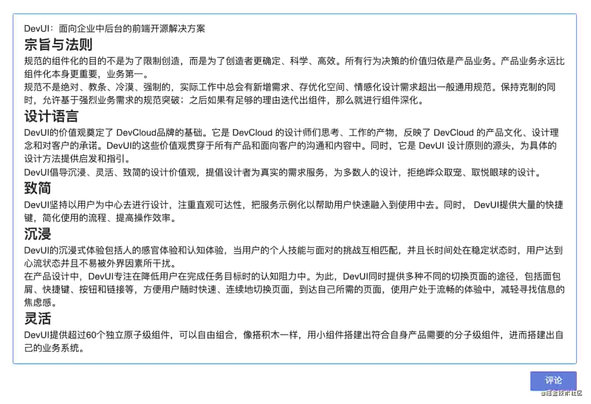
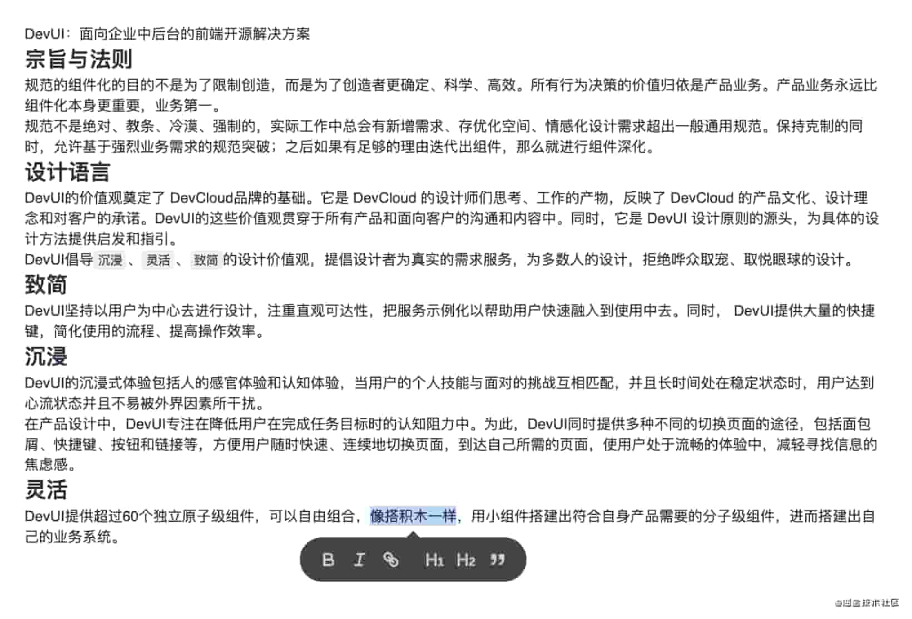
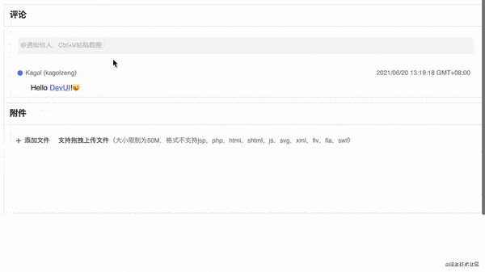

**作者：DevUI团队**

**链接：https://juejin.cn/post/6976023288753586184**

**来源：掘金**

**著作权归作者所有。商业转载请联系作者获得授权，非商业转载请注明出处。**

## 引言
* 之前在HWEB大前端技术分享会上给大家分享过 Quill 的一些实践，不过由于时间关 系只讲了个大概，后续打算深入浅出地对 Quill 做一个详细的介绍。
* 这个系列打算从实践的角度去讲 Quill 富文本编辑器，先从 Quill 的基本使用开 始吧！
### 安装插件
```shell script
npm i quill
```
```html
<div id="editor"></div>
```
```js
// 引入
import Quill from 'quill';
// 使用
const quill = new Quill('#editor');
```
### 配置编辑器容器元素 container
Quill 类一共有两个参数，第一个参数是必选的编辑器容器元素container，可以是一个CSS选择器，比如前面的#editor，也可以是一个DOM元素，比如：
```js
const container = document.getElementById('editor');
// const container = document.querySelector('#editor');
// const container = $('#editor').get(0);
const quill = new Quill(container);
```
如果容器里面已经有一些 HTML 元素，那么初始化 Quill 的时候，那些元素也会渲染出来，比如：
```html
<div id="editor">
  <p>DevUI：面向企业中后台的前端开源解决方案</p>
  <h2>宗旨与法则</h2>
  <p>规范的组件化的目的不是为了限制创造，而是为了创造者更确定、科学、高效。所有行为决策的价值归依是产品业务。产品业务永远比组件化本身更重要，业务第一。</p>
  <p>规范不是绝对、教条、冷漠、强制的，实际工作中总会有新增需求、存优化空间、情感化设计需求超出一般通用规范。保持克制的同时，允许基于强烈业务需求的规范突破；之后如果有足够的理由迭代出组件，那么就进行组件深化。</p>
  <h2>设计语言</h2>
  <p>DevUI的价值观奠定了 DevCloud品牌的基础。它是 DevCloud 的设计师们思考、工作的产物，反映了 DevCloud 的产品文化、设计理念和对客户的承诺。DevUI的这些价值观贯穿于所有产品和面向客户的沟通和内容中。同时，它是 DevUI 设计原则的源头，为具体的设计方法提供启发和指引。</p>
  <p>DevUI倡导<code>沉浸</code>、<code>灵活</code>、<code>致简</code>的设计价值观，提倡设计者为真实的需求服务，为多数人的设计，拒绝哗众取宠、取悦眼球的设计。</p>
  <h2>致简</h2>
  <p>DevUI坚持以用户为中心去进行设计，注重直观可达性，把服务示例化以帮助用户快速融入到使用中去。同时， DevUI提供大量的快捷键，简化使用的流程、提高操作效率。</p>
  <h2>沉浸</h2>
  <p>DevUI的沉浸式体验包括人的感官体验和认知体验，当用户的个人技能与面对的挑战互相匹配，并且长时间处在稳定状态时，用户达到心流状态并且不易被外界因素所干扰。</p>
  <p>在产品设计中，DevUI专注在降低用户在完成任务目标时的认知阻力中。为此，DevUI同时提供多种不同的切换页面的途径，包括面包屑、快捷键、按钮和链接等，方便用户随时快速、连续地切换页面，到达自己所需的页面，使用户处于流畅的体验中，减轻寻找信息的焦虑感。</p>
  <h2>灵活</h2>
  <p>DevUI提供超过60个独立原子级组件，可以自由组合，像搭积木一样，用小组件搭建出符合自身产品需要的分子级组件，进而搭建出自己的业务系统。</p>
</div>
```
渲染出来的编辑器效果：


### 配置选项 options
第二个参数是可选的配置选项options，options是一个JSON对象，比如我们想给我们的编辑器增加一个主题，使它不再那么单调。
```js
const quill = new Quill('#editor', {
  theme: 'snow'
});
```
另外需要引入该主题对应的样式：
```css
@import 'quill/dist/quill.snow.css';
```
除了snow主题，Quill 还内置了一个bubble气泡主题，配置方式和snow主题一样：
* 引入主题样式
* 在options里配置主题

// 引入bubble主题样式
```css
@import 'quill/dist/quill.bubble.css';
```
// 配置
```js
const quill = new Quill('#editor', {
  theme: 'bubble' // 配置 bubble 主题
});
```
效果


* bubble主题没有显性的工具栏，它会在你选中编辑器中的文本时，在选中文本的下方显示一个气泡工具栏，从而对文本进行格式化操作，比如给选中的段落增加引用格式

## 更多配置选项
Quill 不仅仅可以配置主题，options一共支持8个配置选项：
* bounds 编辑器内浮框的边界
* debug debug级别
* formats 格式白名单
* modules 模块
* placeholder 占位文本
* readOnly 只读模式
* scrollingContainer 滚动容器
* theme 主题
### formats 格式白名单
这个配置项非常有用，比如刚刚提到的掘金评论框，我们发现评论框里只能插入纯文本，其他格式都不允许，即使时粘贴进来的格式化文本也会变成纯文本。

在 Quill 里很容易实现，只需要配置formats为空数组即可。
```js
const quill = new Quill('#editor', {
  theme: 'snow',
  formats: []
});
```
注意这里的formats格式白名单，控制的是内容实际的格式，和设置格式的渠道无关，比如formats设置为空，那么无论是：

* 通过工具栏设置格式
* 还是通过快捷键（比如Ctrl+B）设置格式
* 抑或是粘贴带格式的文本

**都是无法设置格式的。**

如果我们想保留一部分格式，比如只保留粗体和列表两种格式：
```js
const quill = new Quill('#editor', {
  theme: 'snow',
  formats: [ 'bold', 'list' ]
});
```
## readOnly 只读模式
通过配置readOnly可以实现：
> 初始状态编辑器是阅读态，不可以编辑，可以通过点击编辑按钮让编辑器变成编辑态。
>
以 DevCloud 看板项目的评论框为例，初始状态下评论是不可编辑的，点击编辑按钮，变成可编辑状态，并且显示工具栏、保存按钮等元素，点击保存按钮，新增的内容被保存，编辑器变成只读态。

## modules 模块配置
Quill 一共有6个内置模块：
* Clipboard 粘贴版
* History 操作历史
* Keyboard 键盘事件
* Syntax 语法高亮
* Toolbar 工具栏
* Uploader 文件上传
### 配置 toolbar 模块
Quill 默认只在工具栏中显示一部分格式化按钮，里面没有插入图片的按钮，我们可以通过配置toolbar模块来增加。
```js
const quill = new Quill('#editor', {
  theme: 'snow',
  modules: {
    toolbar: [
      // 默认的
      [{ header: [1, 2, 3, false] }],
      ['bold', 'italic', 'underline', 'link'],
      [{ list: 'ordered'}, { list: 'bullet' }],
      ['clean'],
      
       // 新增的
      ['image']
    ]
  }
});
```
### 配置 keyboard 模块
除了工具栏模块，我们还可以配置别的模块，比如快捷键模块keyboard，keyboard模块默认支持很多快捷键，比如：

* 加粗的快捷键是Ctrl+B；
* 超链接的快捷键是Ctrl+K;
* 撤销/回退的快捷键是Ctrl+Z/Y。

但它不支持删除线的快捷键，如果我们想定制删除线的快捷键，假设是Ctrl+Shift+S，可以这样配置：
```js
const quill = new Quill('#editor', {
  theme: 'snow',
  modules: {
    toolbar: [
      // 默认的
      [{ header: [1, 2, 3, false] }],
      ['bold', 'italic', 'underline', 'link'],
      [{ list: 'ordered'}, { list: 'bullet' }],
      ['clean'],
      ['image']
    ],
    
    // 新增的
    keyboard: {
      bindings: {
        strike: {
          key: 'S',
          ctrlKey: true,
          shiftKey: true,
          handler: function(range, context) {
            // 获取当前光标所在文本的格式
            const format = this.quill.getFormat(range);
            // 增加/取消删除线
            this.quill.format('strike', !format.strike);
          }
        },
      }
    },
  }
});
```
### 配置 history 模块
Quill 内置的history模块，每隔1s会记录一次操作历史，并放入历史操作栈（最大100）中，便于撤销/回退操作。

如果我们不想记录得那么频繁，想2s记录一次，另外我们想增加操作栈的大小，最大记录200次操作历史，可以这样配置：
```js
const quill = new Quill('#editor', {
  theme: 'snow',
  modules: {
    toolbar: [
      // 默认的
      [{ header: [1, 2, 3, false] }],
      ['bold', 'italic', 'underline', 'link'],
      [{ list: 'ordered'}, { list: 'bullet' }],
      ['clean'],
      ['image']
    ],
    keyboard: {
      bindings: {
        strike: {
          key: 'S',
          ctrlKey: true,
          shiftKey: true,
          handler: function(range, context) {
            // 获取当前光标所在文本的格式
            const format = this.quill.getFormat(range);
            // 增加/取消删除线
            this.quill.format('strike', !format.strike);
          }
        },
      }
    },
    
    // 新增的
    history: {
      delay: 2000, // 2s记录一次操作历史
      maxStack: 200, // 最大记录200次操作历史
    }
  }
});
```
