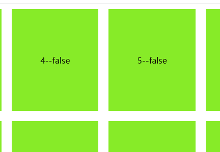

## v-loading

> emmmmmmmmm，v-loading也挺好用的，不过灵活性和扩展性(可扩展组件或者其他逻辑)起来不如[前一篇](./61.在指定dom中添加局部loading)，但重在方便

效果：（是个意思就行，样式自己可以换）



vloading.js

```js
import Vue from 'vue';
import $ from 'jquery'
export default () => {
  Vue.directive('loading',{
    bind:function(el,binding){
      console.log('binding', binding)
      let div = $(`
      <div class='vloading-mask'>
        <div class="vloading-inner">加载中...</div>
      </div>`)[0]
      let posi = window.getComputedStyle(el,null).getPropertyValue('position');
      if(posi == "static" || posi == ""){
        el.style.position = "relative";
      }
      div.style.display="none";
      el.appendChild(div);
      el.loaddiv = div;
      if(binding.value == true){
        div.style.display="flex";
      }else {
        div.style.display="none";
      }
    },
    inserted:function(el){

    },
    update:function(el,binding){
      let posi = window.getComputedStyle(el,null).getPropertyValue('position');
      if(posi == "static"){
        el.style.position = "relative";
      }
      let div = el.loaddiv;
      if(binding.value == true){
        div.style.display="flex";
      }else {
        div.style.display="none";
      }
    },
    unbind:function(el){
      let div = el.loaddiv;
      el.removeChild(div);
      el.dataset.div = null;
    }
  })
}


```

写样式在common.css

```css
.vloading-mask{
  position: absolute;
  display: flex;
  align-items: center;
  justify-content: center;
  width: 100%;
  height: 100%;
  left: 0;
  top: 0;
  z-index: 999;
  background: rgba(0,0,0,0.3);
}
.vloading-inner{
  background: orchid;
}

```

在main.js中引入

```js
import vloading from "./components/js/vloading";
import "./static/common.css";
vloading()
```

在组件中用

```vue
<template>
  <div class="wrap">
    <div
      class="box center"
      v-for="(item, index) in list"
      :ref="`div${index}`"
      :id="`div-${index}`"
      @click="handelClick(index)"
      v-loading="item.loading"
      :key="index">
      {{index}}--{{item.loading}}
    </div>
  </div>
</template>

<script>
  export default {
    name: "test8",
    data() {
      return {
        list: [
          {loading: false},
          {loading: false},
          {loading: false},
          {loading: false},
          {loading: false},
          {loading: false},
          {loading: false},
          {loading: false},
          {loading: false},
          {loading: false},
        ]
      }
    },
    methods:{
      handelClick(index) {
        this.list[index].loading = true
        setTimeout(() => {
          this.list[index].loading = false
        }, 3000)
      }
    }
  }
</script>

<style scoped lang="scss">
  .wrap{
    display: flex;
    align-items: center;
    justify-content: space-between;
  }
  .center{
    display: flex;
    align-items: center;
    justify-content: center;
  }
  .box{
    position: relative;
    width: 200px;
    height: 200px;
    background-color: #87ec28;
    margin: 10px;
  }
</style>

```

