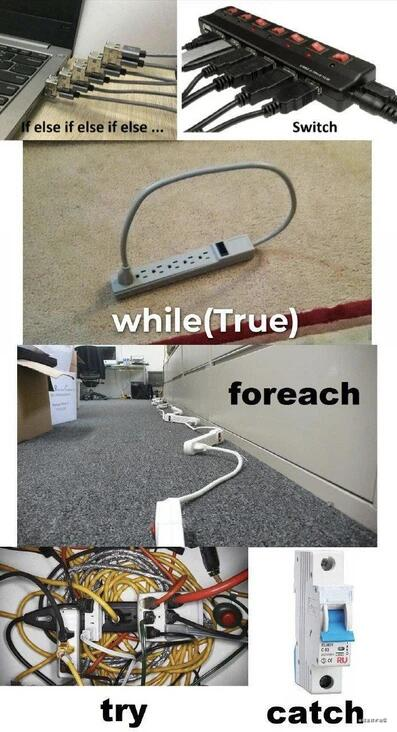

## 分享一些自己日常收获
* 莫名其名的说一些html文件违规，emmmm刷下就好，挺无语的😅😅😅😅，哈密瓜丝，属实是emmmmm(一定要幸福啊)
* 遇到困难摆大烂

 
      
    

* 为什么在markdown里写代码。emmmmmm理由很简单，为了方便复制粘贴。很多时候大家需要的并不是满满登登的一份文件，往往是里面的某些功能点。所以我将一些讲解直接写到注释里，工作+学习二合一。时间紧迫可以直接粘贴，删掉注释即可。时间充裕点可以仔细的读下注释讲解，加深自己的知识。  

* 关于图片路径的问题： 属实没办法，兼顾了markdown就没法兼顾网页了（主要是懒得买服务器，都白朴自行车🚲了，还要啥手表）

* 个人分享 [github地址： https://github.com/a1392558812/myShare](https://github.com/a1392558812/myShare)
* 个人分享 [gitee地址：https://gitee.com/a1392558812/miscellaneous/tree/master](https://gitee.com/a1392558812/miscellaneous/tree/master)

* 个人博客：[https://a1392558812.github.io/myShare/#/](https://a1392558812.github.io/myShare/#/)