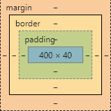

```html
<!DOCTYPE html>
<html>
	<head>
		<meta charset="UTF-8">
		<meta name="viewport" content="width=device,initial-scale=1.0,user-scalable=no" />
		<title>模糊背景(手机端)</title>
		<style type="text/css">
			*{
				padding: 0;
				margin: 0;
			}
			#warp img{
				width: 64px;
				margin: 24px 0 0 24px;
			}
			#warp{
				height: 100px;
				background-color: rgba(0,0,0,0.5);
				position: relative;
			}
			#warp #bg{
				position: absolute;
				left: 0;
				right: 0;
				top: 0;
				bottom: 0;
				background: url(img/09.jpg) no-repeat;
				background-size:100% 100% ;/*设置图片和背景一样大*/
				filter:blur(15px) ;/*让整个元素模糊*/
				z-index: -1;
			}
		</style>
	</head>
	<body>
		<div id="warp">
			
			<div id="bg">
				
			</div>
		</div>
	</body>
</html>

```